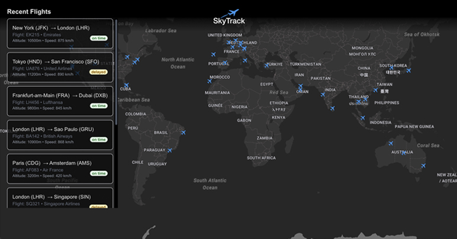

## ✈️ SkyTrack



**SkyTrack** is an interactive flight tracking map that displays airplane positions and flight information.

<a href="https://sky-track-app.vercel.app/" target="_blank">
  
</a>

<br>

## 🚀 Technologies

- Next 15
- Typescript
- Redux
- Rest API
- Sass
- Tailwind
- Material UI

**Assets:**
- Map: [MapLibre](https://maplibre.org/)
- Flight data: Static JSON dataset (mocked data for demonstration purposes)

<br>

## 🛠️ Installation

1. Clone the repository:

```bash
git clone https://github.com/andressa-bertolini/sky-track
cd sky-track
```

2. Install dependencies:
```
npm install
```

3. Start the development server:
```
npm run dev
```

The app will run at http://localhost:3000
